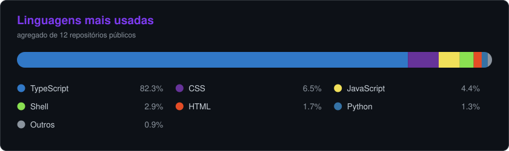

<div align="center">


<br/>

[](https://linkedin.com/in/matheus-de-paula-ribeiro)
[](https://github.com/MatheusRibeir098/forge-kiro)
[](https://github.com/MatheusRibeir098/forge-claude)

<br/>


</div>

---

## 👨‍💻 Sobre mim

```python
matheus = {
    "cargo":        "Estagiário de Dados @ Dati - AI & Cloud",
    "formação":     ["Téc. Desenvolvimento de Sistemas — SENAI ✓",
                     "Ciência de Dados — FURB (2º semestre)"],
    "certificação": "AWS Certified Cloud Practitioner ☁️",
    "foco":         ["TypeScript", "Python", "IA Generativa", "Agentes AI"],
    "diferencial":  "Orquestração multiagente para desenvolvimento de software",
    "status":       "Construindo coisas com IA todos os dias ☕",
}
```

---

## 🔥 Forge — Orquestração de Agentes AI

Meu principal projeto open-source: **sistemas de orquestração multiagente** que automatizam a criação e manutenção de software. Você descreve o que precisa; o orquestrador planeja, delega para subagentes especializados (dev, tester, reviewer), executa em paralelo e entrega validado.

<table>
<tr>
<td width="50%" valign="top">

### [🔥 Forge Kiro](https://github.com/MatheusRibeir098/forge-kiro)

**Orquestração nativa para [Kiro CLI](https://kiro.dev)**

- Subagentes nativos do Kiro (sem tmux)
- DAG com paralelismo e review loops
- 13 agentes especializados
- Model routing (Qwen 0.05x → Opus 2.0x)
- Progressive disclosure de skills
- Economia de 50-70% de tokens por sessão
- Guia de pesquisa sobre economia de tokens

`Kiro CLI` `Custom Agents` `DAG` `Subagents`

</td>
<td width="50%" valign="top">

### [🔥 Forge Claude](https://github.com/MatheusRibeir098/forge-claude)

**Orquestração via tmux para Claude Code**

- Dev + Tester em paralelo via tmux
- Monitor que coordena e valida
- Setup automatizado com `setup-forge.sh`
- Screenshots de validação visual
- Ciclos de correção automáticos

`Claude Code` `tmux` `Shell` `Multiagente`

</td>
</tr>
</table>

---

## 🤖 IA Generativa & Agentes

Trabalho com **IA Generativa aplicada ao desenvolvimento de software** — projeto e orquestro sistemas multiagente que constroem e mantêm projetos completos de forma autônoma.

Áreas de pesquisa ativa:
- Economia de tokens em ferramentas agentic (50-95% de redução)
- Model routing por complexidade de tarefa
- Contratos de saída para comunicação inter-agente
- DAGs de execução com review loops limitados
- Progressive disclosure de contexto

---

## 🛠️ Stack

<div align="center">

**Linguagens**


**Front-end**


**Cloud & Dados**


**AI & Agentes**


</div>

---

## 🚀 Projetos em destaque

| Projeto | O que é | Stack |
|---|---|---|
| **[🔥 forge-kiro](https://github.com/MatheusRibeir098/forge-kiro)** | Orquestração multiagente nativa para Kiro CLI | `Kiro CLI` `Subagents` `DAG` |
| **[🔥 forge-claude](https://github.com/MatheusRibeir098/forge-claude)** | Orquestração multiagente via tmux para Claude Code | `Claude Code` `tmux` `Shell` |
| **[📚 gerador-estudos](https://github.com/MatheusRibeir098/gerador-estudos)** | Gera material de estudo personalizado com IA | `TypeScript` `React` `Express` |
| **[📐 calculadora-grafica-3d](https://github.com/MatheusRibeir098/calculadora-grafica-3d)** | Visualização interativa de funções em 3D | `TypeScript` `React` |
| **[📊 trig-calculator](https://github.com/MatheusRibeir098/trig-calculator)** | Calculadora de trigonometria com gráficos | `TypeScript` `Python` |

---

## 📊 GitHub

<div align="center">

<picture>
  <source media="(prefers-color-scheme: dark)" srcset="langs-dark.svg" />
  <source media="(prefers-color-scheme: light)" srcset="langs-light.svg" />
  
</picture>

<br/><br/>

<picture>
  <source media="(prefers-color-scheme: dark)" srcset="https://streak-stats.demolab.com?user=MatheusRibeir098&hide_border=true&background=0D1117&ring=7C3AED&fire=7C3AED&currStreakLabel=7C3AED&sideLabels=C9D1D9&dates=8B949E&sideNums=C9D1D9&currStreakNum=C9D1D9&stroke=30363D" />
  <source media="(prefers-color-scheme: light)" srcset="https://streak-stats.demolab.com?user=MatheusRibeir098&hide_border=true&background=FFFFFF&ring=7C3AED&fire=7C3AED&currStreakLabel=7C3AED&sideLabels=24292F&dates=57606A&sideNums=24292F&currStreakNum=24292F&stroke=D0D7DE" />
  
</picture>

<br/><br/>

<picture>
  <source media="(prefers-color-scheme: dark)" srcset="https://github-readme-activity-graph.vercel.app/graph?username=MatheusRibeir098&hide_border=true&bg_color=0D1117&color=C9D1D9&line=7C3AED&point=A78BFA&area=true&area_color=7C3AED&title_color=7C3AED" />
  <source media="(prefers-color-scheme: light)" srcset="https://github-readme-activity-graph.vercel.app/graph?username=MatheusRibeir098&hide_border=true&bg_color=FFFFFF&color=24292F&line=7C3AED&point=6D28D9&area=true&area_color=A78BFA&title_color=6D28D9" />
  
</picture>

</div>

---

<div align="center">

*"Código bom é aquele que resolve o problema. Código com IA é aquele que resolve mais rápido."* ☕

</div>
